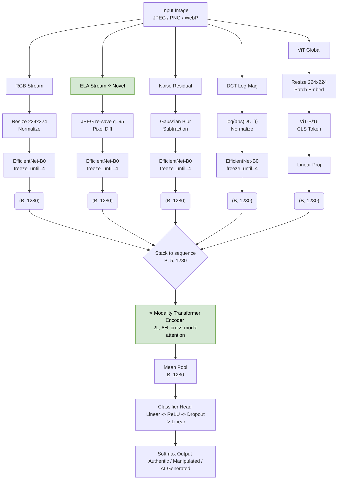

# 🕵️‍♂️ Real-Time Multi-Modal Image Manipulation Detection

[](https://github.com/Hajinsharp/CrossModal-Image-manipulation-detection/actions/workflows/ci.yaml)

**A Thesis Project on Progressive Deep Learning Forensics for Image Tampering and AI Generation Detection**

This repository contains the code and methodology for a progressive ablation study on image manipulation detection. It explores the journey from traditional statistical forensics to a novel **Cross-Modal Transformer Fusion** architecture capable of cross-referencing multiple forensic signals in real-time.

Finally, the project extends its capabilities via transfer learning to a **3-class detection system** (Authentic vs. Traditionally Manipulated vs. AI-Generated), bridging the gap between classic digital forensics and modern Deepfake detection.

---

## ⭐ Distinct Novelty: What & How

Most existing multi-modal forensic systems treat different image views as isolated signals that are simply concatenated at the end of a network. This project introduces two distinct architectural novelties:

### 1. ELA as a Learned Visual Stream (Novelty A)

- **What it is:** Instead of relying on Random Forests to evaluate hand-crafted statistical features (e.g., mean error, edge ratios) from Error Level Analysis (ELA), ELA is introduced as a complete visual tensor.
- **How it works:** The ELA pixel differences are normalized into a 3-channel visual input and fed directly into its own ImageNet-pretrained `EfficientNet-B0` backbone. The network learns _end-to-end_ which specific ELA spatial patterns correlate with manipulation, rather than relying on human-defined heuristics.

### 2. Cross-Modal Transformer Fusion (Novelty B)

- **What it is:** Replacing standard scalar attention or late-stage concatenation with a **Modality Transformer Encoder**.
- **How it works:** The features from all 5 streams `(B, 1280)` are stacked into a sequence `(B, 5, 1280)`. A Transformer Encoder (2 layers, 8 heads) is applied _over the modality dimension_. Each forensic stream attends to all others via multi-head self-attention. This enables complex inter-modality reasoning—for example, if the ELA stream detects heavy re-compression, the Transformer can dynamically upweight the DCT stream to confirm grid anomalies, while suppressing noisy RGB features.

---

## 🏛️ System Architecture

The diagram below outlines the primary contribution of this thesis: **CrossModalFusionNet**.



---

## 📊 Results

Evaluated on CASIA v2.0 (12,614 usable images after filtering non-image files: 7,492 authentic / 5,122 tampered).

| Model                                     | Split                                          |    Acc |   Prec |    Rec |     F1 |    AUC |
| ----------------------------------------- | ---------------------------------------------- | -----: | -----: | -----: | -----: | -----: |
| **CrossModalFusionNet (ours)** [†]        | 70/15/15 stratified, seed 42, argmax threshold | 91.82% | 83.37% | 99.74% | 90.82% | 0.9839 |
| DeepForgeryNet (Sardhara et al. 2026) [1] | 70/15/15 stratified, seed 42, argmax threshold | 99.79% | 99.65% | 99.82% | 99.73% |      — |
| EfficientNetB0 (Buyuk et al. 2026) [2]    | 80/20 stratified\*, argmax threshold           |  75.1% |  73.7% |  75.1% |  72.9% |  0.811 |

\* Paper notes the test set doubled as validation during training — flagged as a caveat, not a clean apples-to-apples comparison.

[†] Produced by [`scripts/evaluate.py`](scripts/evaluate.py) on 2026-07-27 against the real CASIA2 dataset (`best_cross_modal.pth`, 1,894 held-out test images: 1,125 Authentic, 769 Manipulated). Confusion matrix: 972 TN, 153 FP, 2 FN, 767 TP. At the argmax threshold, the model is heavily biased toward flagging things as Manipulated — recall is near-perfect (99.74%) but precision is only 83.37%, meaning 153 of 1,125 authentic images (13.6%) get misflagged. A production deployment should not use argmax/0.5 as the operating threshold without re-deriving an optimal one on a proper validation set.

This is below the thesis's own headline figure (Table 7: Acc=95.35%, F1=94.46%, AUC=0.9927, same dataset/ratios/seed). We isolated the cause by re-running with a Youden's-J-optimal threshold on this _same_ stratified split: Acc rises to only 92.93% (F1 91.83%, AUC unchanged at 0.9839 since AUC is threshold-independent) — closing barely 30% of the gap. **Threshold policy is a minor contributor; the dominant factor is that our stratified split draws a different concrete set of test images than the thesis's non-stratified one.** A second data point supports this: the two "optimal" thresholds themselves are wildly different — τ\*=0.9245 on our split vs. τ\*=0.2472 in the thesis, for the identical P(Manipulated) score convention — meaning the model's confidence distribution looks materially different depending on which images happen to land in test. Given the thesis's own error analysis (Section 5.8) shows failures cluster around specific patterns (heavy post-processing, small manipulated regions), this is plausible: which exact images end up in test vs. train matters a lot for this model on this dataset. Full breakdown, including the ROC-optimal-threshold confusion matrix (1,007 TN, 118 FP, 16 FN, 753 TP), is in [`scripts/eval_results/best_cross_modal_evaluation.json`](scripts/eval_results/best_cross_modal_evaluation.json).

CrossModalFusionNet clearly outperforms plain-EfficientNetB0 (no forensic streams) by a wide margin, but loses to DeepForgeryNet on every metric — worth investigating (ResNet50+LSTM backbone vs. our 5-stream fusion) rather than glossing over.

### 3-class extension (Authentic / Traditionally Manipulated / AI-Generated)

Fine-tuned from the checkpoint above on CASIA2 + CIFAKE (Stable Diffusion v1.4) — see `thesis_report.pdf`, Table 18, for the thesis's own figure: 96.36% accuracy, macro F1 0.9638 on a held-out _validation_ set (3,074 images), with perfect AI-Generated detection (F1=1.000).

Re-run with [`scripts/evaluate.py`](scripts/evaluate.py) on 2026-07-27 (`best_cross_modal_3class.pth`, real CASIA2 + CIFAKE data, stratified split, seed 42, each class capped at 5,123 images to match the thesis's own balancing strategy, Table 16): **97.49% accuracy, macro F1 0.9748** (Authentic F1=0.9612, Manipulated F1=0.9633, AI-Generated F1=1.0000 — again perfect, 0 misclassifications either direction). Confusion matrix: 51 Authentic→Manipulated, 7 Manipulated→Authentic.

**This number is higher than the thesis's own figure, and that is not a good sign here** — the opposite of the 2-class case above. The 3-class fine-tuning stage (notebook Section 14) only ever carved an 80/20 train/val split with no held-out test set, so a freshly-drawn stratified split very likely overlaps with images the model was directly trained on. A higher score under these conditions is consistent with train/test leakage inflating the result, not genuine improvement. Until the model is retrained with a true 3-way split, treat both this number and the thesis's Table 18 figure as upper bounds, not clean generalization estimates. Full breakdown in [`scripts/eval_results/best_cross_modal_3class_evaluation.json`](scripts/eval_results/best_cross_modal_3class_evaluation.json).

[1] Sardhara, Vekariya, Pathak, Dash. "DeepForgeryNet: a hybrid CNN–LSTM and transfer learning framework for robust image forgery and deepfake detection." _Frontiers in Artificial Intelligence_, vol. 9, 2026.
[2] Buyuk, Karatas Baydogmus, Buldu, Tulendiyeva, Baizhumanova. "Digital Image Forgery Detection Using Transfer Learning." arXiv:2605.08167, 2026.

---

## 🚀 Quickstart

```bash
git clone https://github.com/Hajinsharp/CrossModal-Image-manipulation-detection.git
cd CrossModal-Image-manipulation-detection
python -m venv .venv
source .venv/bin/activate   # Windows: .venv\Scripts\Activate.ps1
pip install -r requirements.txt
python src/predict.py --image assets/sample_authentic.jpg
```

Weights (~520 MB, 3-class) download automatically from [Hugging Face Hub](https://huggingface.co/Roy407/crossmodalfusionnet) on first run and are cached locally afterward — no manual download step.

`assets/sample_authentic.jpg` and `assets/sample_manipulated.jpg` are both derived from public-domain USFWS photographs ([landscape](https://commons.wikimedia.org/wiki/File:Dusk_landscape_high_resolution.jpg), [pronghorn](https://commons.wikimedia.org/wiki/File:Pronghorn_Antelope_USFWS.jpg)) rather than the CASIA2 dataset — CASIA2's own redistribution terms are unclear (see "Reproducing the results" further down), so nothing derived from it ships in this repo. The "manipulated" sample is a splice of the two, built for this repo — it is *not* reliably caught by the model (79% confidence Authentic), which is itself a real, honest data point: it's out-of-distribution relative to CASIA2's specific tampering pipeline, consistent with the cross-dataset generalisation gap documented above.

Expected output (this is real output from this exact command, not idealised):

```
Prediction: Authentic (86.5%)

  Authentic        0.8652
  Manipulated      0.1208
  AI-Generated     0.0140
```

---

## 🩺 Run the API

```bash
python -m uvicorn api:app --app-dir src --host 0.0.0.0 --port 8000
```

Or via Docker:

```bash
docker build -t crossmodalfusionnet .
docker run -p 8000:8000 crossmodalfusionnet
```

Real output from a local run against the commands below:

```bash
curl http://localhost:8000/health
```

```json
{"status":"ok","classes":["Authentic","Manipulated","AI-Generated"]}
```

```bash
curl -F "file=@assets/sample_authentic.jpg" http://localhost:8000/predict
```

```json
{"prediction":"Authentic","confidence":0.8652,"scores":{"Authentic":0.8652,"Manipulated":0.1208,"AI-Generated":0.014}}
```

Interactive docs (upload an image from a browser, no client code needed): `http://localhost:8000/docs`

---

## 🔁 Reproducing the results

1. **Get the data.** CASIA2 is not bundled here — its redistribution terms aren't clearly stated by the original source ([NLPR/CASIA, gated access](http://forensics.idealtest.org)), only that it's free for research use, so nothing derived from it ships in this repo (see the note in Quickstart above). Obtain `Au/` and `Tp/` yourself. For the 3-class checkpoint you'll also need [CIFAKE](https://www.kaggle.com/datasets/birdy654/cifake-real-and-ai-generated-synthetic-images)'s `train/FAKE` split.
2. **Run the evaluation:**
   ```bash
   python scripts/evaluate.py --weights best_cross_modal.pth \
       --casia-auth path/to/CASIA2/Au --casia-manip path/to/CASIA2/Tp
   # 3-class: add --ai-generated path/to/cifake/train/FAKE --max-per-class 5123
   ```
3. Full per-class metrics, confusion matrix, and ROC analysis print to stdout and save as JSON under `scripts/eval_results/`.

Runtime: ~16 minutes for the 2-class checkpoint (1,894 test images), ~23 minutes for the 3-class checkpoint (2,307 test images) — both measured on a CPU-only machine (no GPU). The numbers in the Results table above came from exactly these runs.

---

## 📁 Repository layout

| Path                          | Purpose                                     |
| ------------------------------ | -------------------------------------------- |
| `src/model.py`                | `CrossModalFusionNet` architecture          |
| `src/preprocess.py`           | ELA / noise / DCT stream extraction         |
| `src/predict.py`              | Single-image inference                      |
| `src/api.py`                  | FastAPI serving layer                       |
| `scripts/evaluate.py`         | Reproduces the results table above          |
| `scripts/verify_checkpoint.py`| Checkpoint sanity-checker                   |
| `tests/`                      | API test suite (6 tests, run in CI)         |
| `assets/`                     | Sample images used by Quickstart            |
| `Dockerfile`                  | CPU-only serving image                      |
| `.github/workflows/ci.yaml`   | CI: tests + Docker build on every push      |
| `RealTimeMultiModal_Fixed.ipynb` | Canonical training notebook (all 7 model variants) |
| `thesis_report.pdf`           | Full thesis writeup                         |
